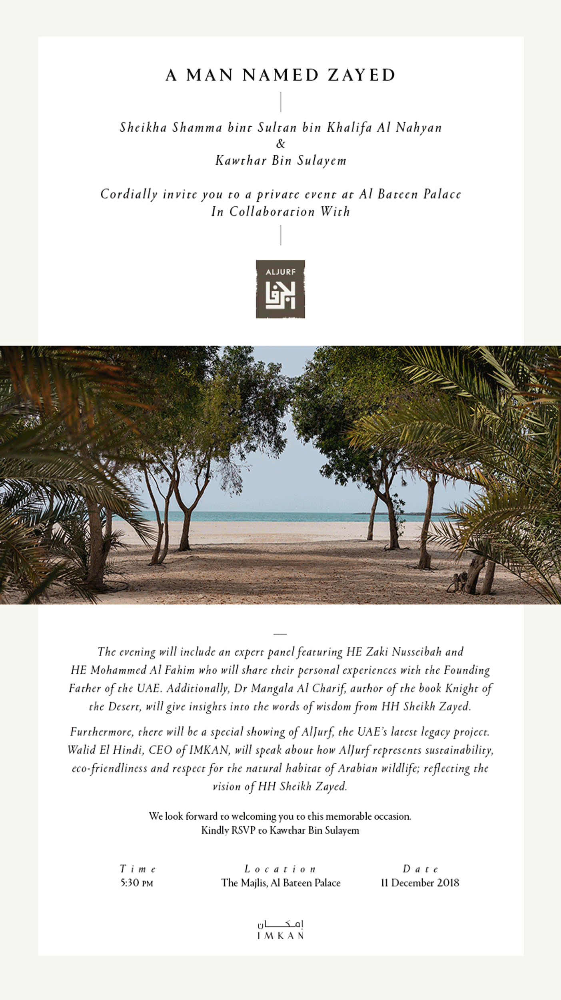

<video autoplay loop muted playsinline poster="resources/adbf.jpg" preload="auto">
    <source src="resources/events.webm" type="video/webm">
    <source src="resources/events.mp4" type="video/mp4">
    Your device doesn't support this video.
</video>

Lancement de la version arabe du livre «Chevalier du Désert» dans le cadre des activités du Salon International du Livre d'Abu Dhabi (ADIBF) en présence de Son Excellence Cheikh Nahyan bin Mubarak Al Nahyan, Ministre de la tolérance, Son Excellence Cheikha Lubna Al Qasimi, Cheikh Ahmed bin Sultan bin Saqr Al Qasimi, Cheikh Dhiab bin Khalifa bin Shakhbut Al Nahyan et Son Excellence Monsieur Nafdeeb Singh Suri, Ambassadeur de la République de l'Inde dans le pays.

{:.no_margins}

La cérémonie a également réuni Son Excellence Dr Saeed Ahmed Ghobash, président de l'Université des Émirats Arabes Unis, Son Excellence Mubarak Al Shamsi, directeur général du Centre d'Abu Dhabi pour l'Enseignement et la Formation Techniques et Professionnels, Maitha Al Habsi, PDG de la Fondation des Émirats Arabes Unis, Mohamed Salem Al Dhaheri, conseiller du chef du Département de l'éducation et du Savoir, Dina Assaf, coordinatrice des Nations Unies, Dr Sulaiman Al Hattlan, fondateur et PDG de Hatlan Media et de nombreux intellectuels, écrivains et penseurs.

{:.multicols.fullheight}

