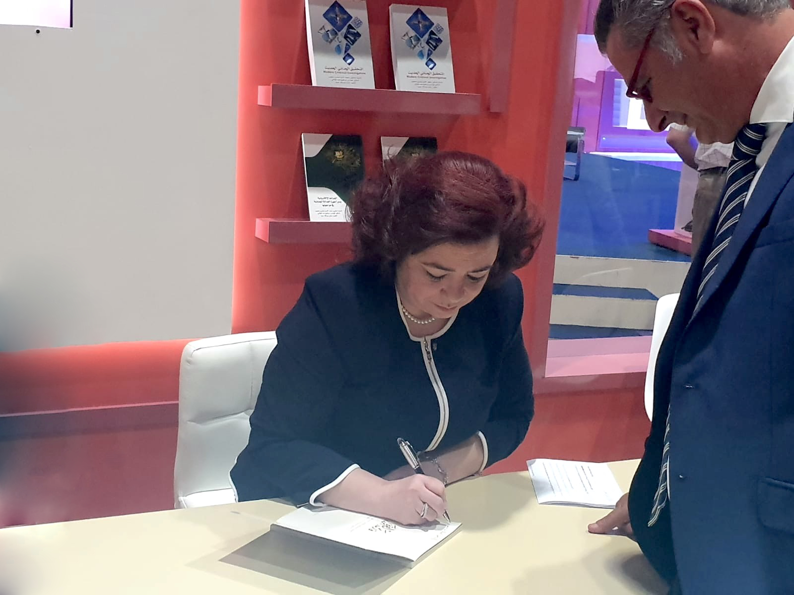

{:.quote}

{:.no_margins}

{:.quote}

# Synopsis

{:.multicols}
Ce livre prouve qu’il y a un fond philosophique profond qui soutient la pensée de Cheikh Zayed Bin Sultan Al Nahyan. L'étude ne cherche pas à enfermer les paroles du Père Fondateur des E.A.U. dans des problématiques réductrices, mais d’offrir au lecteur un trajet de lecture possible. L’approximation de l’Etre est en fait ce qu’il y a de plus original dans son expérience. Son talent consiste à pénétrer le plus secret du monde, le plus intime de l’Etre. Rares sont les personnes qui témoignent d’un tel souci ontologique mais tel est le témoignage digne du père de la nation.
  
Sheikh zayed nous appelle à un monde de dépassement perpétuel. Le désert lui apprend de prendre ses distances phénoménologiques et ontologiques par rapport au monde. Cet espace constitue une donnée intérieure qui lui est inhérente et fait partie intégrante de son expérience de vivre. L’expérience du désert est pour lui un moyen de naître à la sagesse et à un mode de vie spirituelle. Elle le purifie et lui donne accès à une expérience unique où se rencontrent l’Etre et l’Absolu, à un monde dans lequel la grâce cesse d’être un don divin pour devenir l’expression d’un mérite humain. Son message n’est pas porteur de vérités absolues. Père fondateur, Sheikh Zayed l’est également par la pensée...
