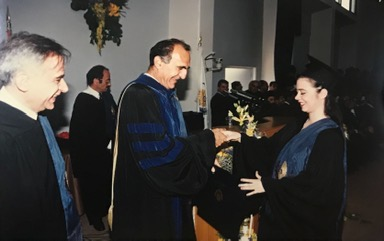

  
  

    <h1>Thèse de Doctorat</h1>
    <h2>En français</h2>
    
Saint-John Perse et Adonis, Poétique Comparée  &nbsp; - 2003, Université de la Sorbonne Nouvelle Paris 3.

  

{:.hideOnMobile}
## Contenu de la thèse

La traduction par ‘Ali Ahmad Sa’id Isbir poétiquement baptisé Adonis (1930-, poète syrien/libanais) de l’œuvre de Saint-Leger Leger célèbre sous le pseudonyme de Saint-John Perse (1887-1975, poète français) est le cadre d’une rencontre fructueuse. Ouvert à la littérature mondiale et sensible à son charme, le créateur arabe parvient à suivre le mouvement de la modernité dans le monde et à apporter sa contribution à la poésie. Il nous offre une oeuvre à la hauteur de celles qui ont vu le jour en Occident et digne d’une étude comparée avec celle d’un grand poète comme Saint-John Perse.
  
Une étude de l’ensemble de l’œuvre en prose des deux poètes nous permet de dégager chez eux les fondements d’un art poétique. Il s’agit d’une série de visions nouvelles faisant inéluctablement appel à une nouvelle conception de la poésie, du poète et de l’écriture. L'étude de l’œuvre poétique proprement dite “Exil”, “Pluies”, “Neiges”, “Poèmes à l’Etrangère” et “Vents” chez Saint-John Perse et “Chants de Mihyar le Damascène”, “Tombeau pour New York”, “Désert”, “Célébrations”, “Mémoire du Vent”, “Le temps les Villes” et “Le Poème de Babel” chez Adonis permet de vérifier, sur le plan poétique, les conceptions théoriques et conditionne ainsi une meilleure évaluation de l’ensemble de l’œuvre.
  
Les lieux d’entrecroisement de ces deux écritures poétiques sont de loin plus nombreux que ceux de leur séparation. Les deux oeuvres se rencontrent sur maints niveaux de la conception et de la production poétique proprement dite. Cependant chaque expérience se déploie selon la jalouse particularité de son auteur. Héritier d’un fonds culturel ample et divers, Saint-John Perse en recueille une richesse inépuisable qui lui apprend à harmoniser les tendances contradictoires de la pensée universelle et attribue à son écriture un cachet propre. Sensible à la conception poétique qui préside l’écriture chez Saint-John Perse, Adonis de sa part demeure un héritier de la mystique orientale et de la flamme qui a nourri la poésie arabe ancienne. Son écriture est une arabesque née du tissage entre l’héritage arabe dans lequel il réussit à capter les germes du renouveau et la modernité poétique occidentale. En dépit du refus qui anime son oeuvre et de l’hostilité pour le passé dont elle est accusée, la poésie adonisienne s’avère bien ancrée dans son cadre arabe que le poète oeuvre à dynamiser. C’est cette dimension qui permet à Adonis de maintenir ses grandes distances vis-à-vis du poète français en dépit des ressemblances qui le rattachent à lui.

  
  

    <h1>Mémoire de DEA</h1>
    <h2>En français</h2>
    
La Révolte chez Saint-John Perse  &nbsp; - 1998, Université de Balamand.

  

{:.hideOnMobile}
## Contenu du mémoire

La poésie est conçue chez Saint-John Perse comme un acte de présence au monde, un mode de connaissance et un mode de vie. Il a envisagé le don poétique comme un ébranlement de l'Etre et une expérimentation de l’homme et du monde. Son talent poétique consiste à pénétrer le plus secret du monde, le plus intime de l’Etre. Rares sont les poètes qui témoignent avec autant d’originalité d’un tel souci ontologique mais tel est le témoignage digne du poète moderne et universel. Le poète se fait une haute conception du poète et de sa mission. Le poète est pour lui un homme d’action, un “être dans le monde” en même temps qu’un “être en relation au monde”. Etre conscient, l’inspiration n’existe pas pour lui dans un monde suprême mais se situe sur le plan d’une expérience profondément vécue par le poète. Ce n’est pas dans la méditation passive que s’affirme le don poétique. L’acte poétique est un acte de conscience et le poète est appelé à exercer un perpétuel effort et à cultiver une parfaite clairvoyance.
  
Il se pose comme un créateur devant la réalité sensible et cherche à ébranler la société dans ses bases et ses fondements. Sincère avec ses lecteurs, il s’abstient de leur communiquer de réponse mais les opposant à leurs problèmes, il leur dévoile les horreurs de leur existence et les invite à l’action. Il vise à la recréation du monde et des hommes par la puissance évocatoire du langage devenu Verbe poétique. Le message poétique n’est pas porteur de vérités absolues. Maître, le poète l’est par la pensée. Sa tâche ne consiste pas à transmettre la sagesse aux lecteurs mais à les initier à la quête de la vérité dont le message poétique est porteur. Son rôle consiste à secouer les hommes endormis, à les faire sortir du monde de l’habitude et à les inviter à tout revoir. La modernité de l’expérience donne naissance à une écriture nouvelle et fait par suite inéluctablement appel à un lecteur nouveau.
  
Les éléments fournissent au poète une riche matière poétique. Une analyse des images élémentaires de l’Eau, de l’Air et du Feu nous permet de dégager le mouvement dialectique refus-dépassement et destruction-création qui anime l'écriture poétique. C’est le temps d’un nouveau baptême de l’homme, du monde et du langage. Combustion, ablution et éventement s’avèrent ainsi les trois aspects d’un même itinéraire, celui de la renaissance à la pureté...
